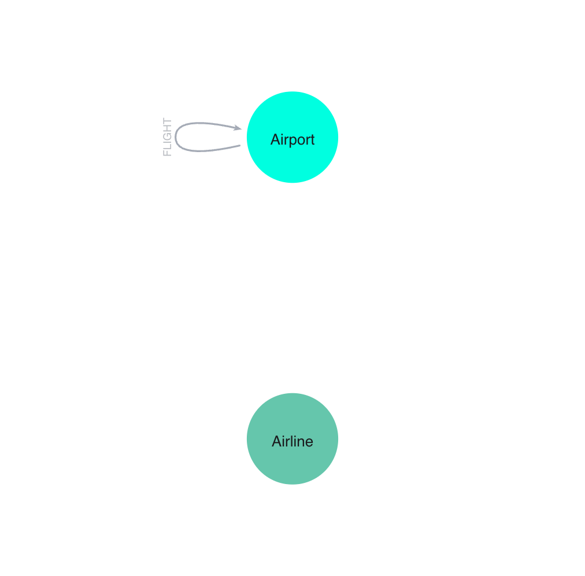

## Introduction

Ce projet compare les performances et l'expressivité de Cypher 5 et Cypher 25 sur un dataset réel de vols. Le dataset choisi représente les vols américains de la première semaine de janvier 2015 : 107 230 vols entre 313 aéroports, opérés par 14 compagnies.

## Choix et Modélisation des Données

### Source des données

#### Choix initial : Dataset IDFM (abandonné)

Nous avions initialement envisagé d'utiliser les données GTFS d'IDFM représentant le réseau de transports en commun francilien. Ce dataset présentait plusieurs fichiers interconnectés :

- `agency.csv` : Agences de transport
- `routes.csv` : Lignes de transport
- `trips.csv` : Trajets
- `stop_times.csv` : Horaires d'arrêt pour chaque trajet
- `stops.csv` : Stations et arrêts
- `transfers.csv` : Correspondances entre arrêts
- `pathways.csv` : Chemin piétons dans les stations

**Problème identifié** : Cette structure est orientée relationnelle. La modélisation en graphe était trop complexe :

- Les "nœuds" étaient des stations, mais les relations entre elles ne sont pas directes
- Il faut passer par 4 tables intermédiaires (route -> trip -> stop_time) pour relier deux stations
- Les propriétés intéressantes (horaires, fréquences) sont dispersées dans plusieurs tables

C'est d'ailleurs un cas où PostgreSQL est mieux adapté que Neo4j : les données GTFS ont été conçues pour des requêtes relationnelles (jointures, agrégations temporelles).

#### Choix final : Dataset de vols américains

Dataset Kaggle "2015 Flight Delays and Cancellations" (US Department of Transportation) :

- Source : 5,8 millions de vols sur l'année 2015
- Échantillon retenu : Première semaine de janvier
- Raison : Volume raisonnable tout en conservant un nombre de données suffisantes pour avoir des requêtes intéressantes



### Nettoyage des données

Le script `scripts/normalize_data.py` effectue plusieurs transformations :

1. **Filtrage temporel** : Sélection des vols du 1er au 7 janvier 2015
2. **Gestion des timestamps** :
   - Conversion des horaires HHMM vers des timestamps utilisable par Neo4j/PostgreSQL
   - Traitement du minuit (2400 -> 0000)
   - Détection des vols de nuit (arrivée le lendemain)
3. **Suppression des valeurs manquantes** : Retrait des vols sans horaires de départ/arrivée
4. **Filtrage des aéroports** : Seuls les aéroports utilisés dans les vols sont conservés

### Modèle de graphe Neo4j

**Nœuds** :

- `Airport` (313) : Code IATA, nom, ville, état, coordonnées GPS
- `Airline` (14) : Code IATA, nom de la compagnie

**Relations** :

- `FLIGHT` (107 230) : Propriétés :
  - `departure_ts` / `arrival_ts` : Timestamps
  - `distance` : Distance en miles
  - `delay` : Retard au départ en minutes (peut être négatif)
  - `airline` : Code de la compagnie

**Contraintes** :

- Unicité des codes IATA (airports et airlines)
- Index sur `departure_ts`, `distance`, `delay` pour optimiser les requêtes

**Choix de modélisation** : Chaque vol est une relation unique, identifiée par son timestamp. Cela évite le problème des multi-edges : ANC->SEA à 23h54 et ANC->SEA à 08h30 sont deux relations distinctes, ce qui simplifie les requêtes de chemins temporels.

### Modèle relationnel PostgreSQL

```
airlines
  - iata_code (PK)
  - name

airports
  - iata_code (PK)
  - name, city, state, country
  - latitude, longitude

flights
  - id (PK)
  - source (FK -> airports.iata_code)
  - target (FK -> airports.iata_code)
  - airline (FK -> airlines.iata_code)
  - departure_ts, arrival_ts
  - distance, delay
  - CHECK (source != target AND distance > 0)
```

Index sur `source`, `target`, `departure_ts` pour optimiser les requêtes récursives.

## Comparaison des Requêtes

### 1. Chemins avec propriété croissante

**Problème** : Trouver des itinéraires LAX->JFK où le retard augmente à chaque escale.

**Cypher 5** (NOT EXISTS) :
```cypher
MATCH path = (start:Airport {iata_code: 'LAX'})
  -[:FLIGHT*2..4]->(end:Airport {iata_code: 'JFK'})
WHERE NOT EXISTS {
  WITH path
  UNWIND range(0, size(relationships(path))-2) AS i
  WITH relationships(path) AS rels, i
  WHERE rels[i].delay >= rels[i+1].delay
  RETURN 1
}
RETURN [n IN nodes(path) | n.iata_code] AS route
LIMIT 50;
```

Stratégie : Génère TOUS les chemins (319 631), puis filtre *a posteriori*.

**Résultats** :

- Temps : ~1,5 seconde
- DB Hits : 16 340 381
- Rows traitées : 320 799

**Cypher 25** (allReduce) :
```cypher
MATCH path = (start:Airport {iata_code: 'LAX'})
  ((:Airport)-[f:FLIGHT]->(:Airport)){2,4}
  (end:Airport {iata_code: 'JFK'})
WHERE allReduce(
  prev_delay = -999999.0,
  rel IN f |
    CASE
      WHEN rel.delay > prev_delay THEN rel.delay
      ELSE null
    END,
  prev_delay IS NOT NULL
)
RETURN path LIMIT 50;
```

Stratégie : Filtre PENDANT la traversée grâce à l'opérateur Trail.

**Résultats** :

- Temps : ~3,5 ms
- DB Hits : 39 904
- Rows traitées : 9 290

**Gain** : 

- Temps : 1 496,5ms de moins
- DB Hits : 16 300 477 de moins
- Rows traitées : 311 509 de moins

**Plan d'exécution** :

- Cypher 5 : `VarLengthExpand` génère tout puis `Apply+Anti` filtre
- Cypher 25 : `Repeat(Into,Trail)` avec pruning inline

### 2. Quantified Graph Patterns

**Problème** : Trouver des itinéraires avec exactement N escales, sans repasser par le même aéroport.

**Cypher 5** (explicite) :
```cypher
MATCH path = (start:Airport {iata_code: 'LAX'})
  -[:FLIGHT]->(hub1:Airport)
  -[:FLIGHT]->(hub2:Airport)
  -[:FLIGHT]->(end:Airport {iata_code: 'JFK'})
WHERE start <> hub1 AND start <> hub2 AND start <> end
  AND hub1 <> hub2 AND hub1 <> end
  AND hub2 <> end
RETURN [n IN nodes(path) | n.iata_code] AS route
LIMIT 10;
```

7 lignes, 6 comparaisons pour éviter les cycles.

**Cypher 25** (quantified) :
```cypher
MATCH path = (start:Airport {iata_code: 'LAX'})
  (()-[:FLIGHT]->(:Airport)){3}
  (end:Airport {iata_code: 'JFK'})
WHERE allReduce(
  seen = [],
  n IN nodes(path) | seen + n,
  single(x IN seen WHERE x = n)
)
RETURN [n IN nodes(path) | n.iata_code] AS route
LIMIT 10;
```

1 ligne pour le pattern, `allReduce()` pour détecter les cycles. Pour un range (2-3 escales), on change juste `{3}` en `{2,3}`.

**Intérêt** : Améliore la maintenabilité. Modifier la profondeur = changer un chiffre vs réécrire le pattern entier.

### 3. Plus courts chemins pondérés

**Problème** : Trouver l'itinéraire JFK->DAY minimisant la distance totale.

C'est ici que les limites de Cypher pur deviennent flagrantes.

**Cypher 5** (`shortestPath`) Pas pondéré :
```cypher
MATCH path = shortestPath(
  (start:Airport {iata_code: 'JFK'})-[:FLIGHT*]->(end:Airport {iata_code: 'DAY'})
)
RETURN [n in nodes(path) | n.iata_code] AS route,
       reduce(dist = 0, r in relationships(path) | dist + r.distance) AS total_distance;
```

**Résultat** :

- Route : [JFK, ATL, DAY]
- Distance : 1192 miles
- Temps : 15 ms

**Problème** : `shortestPath()` minimise le nombre de sauts, pas la distance. Le vrai chemin optimal (JFK->BWI->DAY) fait 590 miles mais passe par 2 sauts aussi. L'algorithme BFS ne considère pas les poids.

**Cypher 5/25 pondéré** :
```cypher
MATCH path = (start:Airport {iata_code: 'JFK'})-[:FLIGHT*1..3]->(end:Airport {iata_code: 'DAY'})
WITH path, reduce(dist = 0, r in relationships(path) | dist + r.distance) AS total_distance
ORDER BY total_distance
LIMIT 1
RETURN [n in nodes(path) | n.iata_code] AS route, total_distance;
```

**Résultat** :

- Route : [JFK, BWI, DAY]
- Distance : 590 miles (optimal)
- Temps : 293 ms

**Explosion combinatoire** :

- `*1..2` (2 sauts max) : 293 ms
- `*1..3` (3 sauts max) : 137 secondes
- `*1..4` (4 sauts max) : timeout

Au-delà de 2-3 sauts, la requête devient inutilisable.

**GDS Dijkstra** :
```cypher
CALL gds.graph.project('flights', 'Airport', {
  FLIGHT: { properties: 'distance' }
});

MATCH (source:Airport {iata_code: 'JFK'})
MATCH (target:Airport {iata_code: 'DAY'})
CALL gds.shortestPath.dijkstra.stream('flights', {
  sourceNode: source,
  targetNode: target,
  relationshipWeightProperty: 'distance'
})
YIELD totalCost, nodeIds
RETURN [nodeId in nodeIds | gds.util.asNode(nodeId).iata_code] AS route,
       totalCost AS total_distance;
```

**Résultat** :

- Route : [JFK, BWI, DAY]
- Distance : 590 miles (optimal garanti)
- Temps : 37 ms

**Comparaison** :

- Cypher 5 : Non pondéré, pas optimal
- Cypher 25 : Timeout au-delà de 2-3 sauts
- GDS Dijkstra : Toujours performant, optimal, scalable

**Conclusion** : Pour des chemins pondérés, GDS est obligatoire. Cypher pur n'a pas les structures de données nécessaires (priority queue).

### 4. Implémentation d'algorithmes GDS en Cypher 25

**Objectif** : Reproduire des algorithmes de GDS avec du Cypher pur pour comparer les approches.

**Degree Centrality** :

GDS :
```cypher
CALL gds.degree.stream('my-graph')
YIELD nodeId, score
RETURN gds.util.asNode(nodeId).iata_code AS airport, score
ORDER BY score DESC LIMIT 10;
```

Cypher 25 :
```cypher
MATCH (a:Airport)
OPTIONAL MATCH (a)-[:FLIGHT]->()
WITH a, count(*) AS out_degree
OPTIONAL MATCH (a)<-[:FLIGHT]-()
WITH a, out_degree, count(*) AS in_degree
RETURN a.iata_code AS airport, out_degree + in_degree AS degree
ORDER BY degree DESC LIMIT 10;
```

**Résultat** : Performances similaires pour ce cas simple.

**Triangle Count** :

GDS :
```cypher
CALL gds.triangleCount.stream('my-graph')
YIELD nodeId, triangleCount
RETURN gds.util.asNode(nodeId).iata_code AS airport, triangleCount
ORDER BY triangleCount DESC LIMIT 10;
```

Cypher 25 :
```cypher
MATCH (a:Airport)-[:FLIGHT]->(b:Airport)-[:FLIGHT]->(c:Airport)-[:FLIGHT]->(a)
RETURN a.iata_code AS airport, count(*) AS triangles
ORDER BY triangles DESC LIMIT 10;
```

**Problème** : Cette requête compte chaque triangle 3 fois (une fois par sommet). Correction :
```cypher
WITH a, count(*) / 3 AS triangleCount
```

**Observation** : Pour des algorithmes polynomiaux simples, Cypher 25 est compétitif. L'overhead de GDS (projection du graphe) peut même le rendre plus lent.

**Limite** : Dès qu'on passe à des algorithmes nécessitant des structures de données avancées (Dijkstra, PageRank, Betweenness Centrality), GDS devient indispensable. Ces algorithmes ne sont pas implémentables efficacement en Cypher.

## Équivalents SQL

### Chemins avec propriété croissante

SQL ne supporte pas nativement les path queries. Il faut utiliser une requête récursive :

```sql
WITH RECURSIVE flight_paths AS (

    SELECT
        f.source,
        f.target,
        f.arrival_ts AS last_arrival_ts,
        f.delay AS last_delay,
        1 AS hops,

        ARRAY[f.source, f.target]::VARCHAR[] AS route,
        ARRAY[f.delay]::NUMERIC[] AS delays,

        f.delay::NUMERIC AS total_delay
    FROM flights f
    WHERE f.source = 'LAX'

    UNION ALL

    SELECT
        fp.source,
        f.target,
        f.arrival_ts,
        f.delay,
        fp.hops + 1,
        fp.route || f.target,
        fp.delays || f.delay,
        fp.total_delay + f.delay
    FROM flights f
    INNER JOIN flight_paths fp ON f.source = fp.target
    WHERE
        fp.hops <= 4
        AND f.delay > fp.last_delay
        AND f.departure_ts > fp.last_arrival_ts
)

SELECT
    route,
    delays,
    hops,
    total_delay
FROM flight_paths
WHERE target = 'JFK'
  AND hops >= 2
LIMIT 50;
```

**Différences** :

- Plus verbeux (44 lignes vs 10 pour Cypher 25)
- Nécessite de gérer manuellement les timestamps (`f.departure_ts > fp.last_arrival_ts`)
- Moins lisible : la logique métier (delay croissant) est noyée dans la syntaxe récursive
- Accumule à chaque itération

## Limitations et Extensions Possibles

### Limites du projet

Une semaine de données limite les chemins testables à 2-3 escales maximum. Les requêtes ne vérifient pas les contraintes temporelles strictes entre vols (temps de correspondance), bien que cela soit possible avec `allReduce()`. Nous n'avons pas comparé GDS avec des extensions PostgreSQL comme pgRouting pour Dijkstra.

La feature `REPEATABLE ELEMENTS` de Cypher 25 n'a pas été testée car elle n'est pas pertinente ici. Chaque vol est unique (identifié par son timestamp), donc deux vols ANC->SEA à des heures différentes sont déjà des relations distinctes. Les itinéraires circulaires (LAX->ATL->LAX->JFK) n'ont pas de sens pour des vols commerciaux.

## Conclusion

Ce projet confirme les résultats de l'article SIGMOD. Cypher 5 avec `reduce()` dans WHERE ne passe pas à l'échelle et génère tous les chemins puis filtre, tandis que Cypher 25 filtre pendant la traversée avec `allReduce()`, évitant l'explosion combinatoire.

Les quantified patterns simplifient le code pour les patterns répétitifs. Cependant, pour les chemins pondérés (Dijkstra), GDS reste indispensable car Cypher pur manque de structures optimisées (priority queues). Au-delà de 2-3 sauts, les requêtes timeout.

Le SQL récursif reste verbeux et peu lisible pour les path queries. Sans équivalent à `allReduce()`, les performances sont comparables à Cypher 5, et la logique métier se perd dans la syntaxe récursive.

---

PDF du rapport généré avec [pandoc](https://pandoc.org/) depuis un fichier markdown.